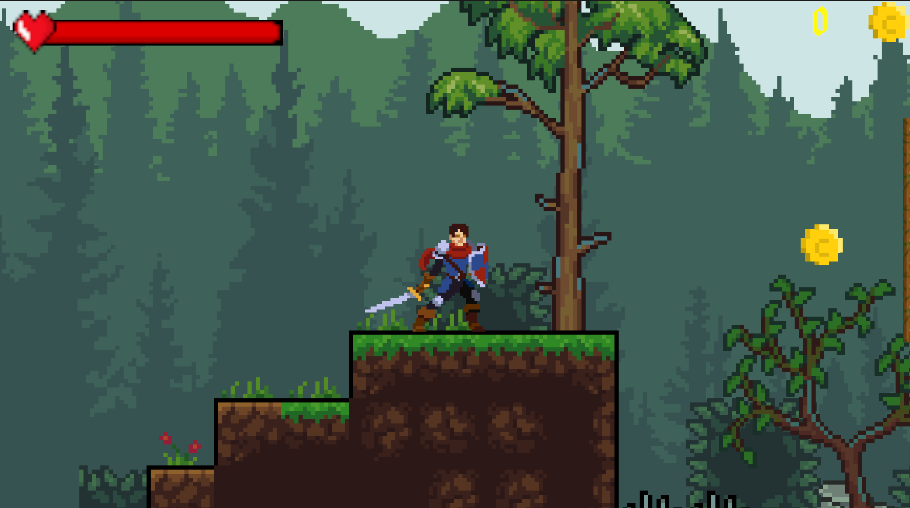
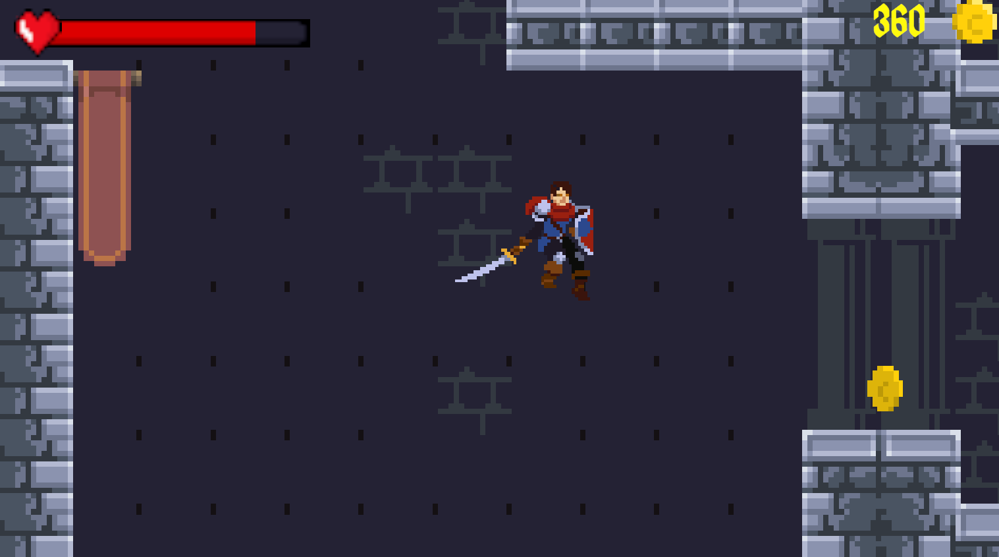
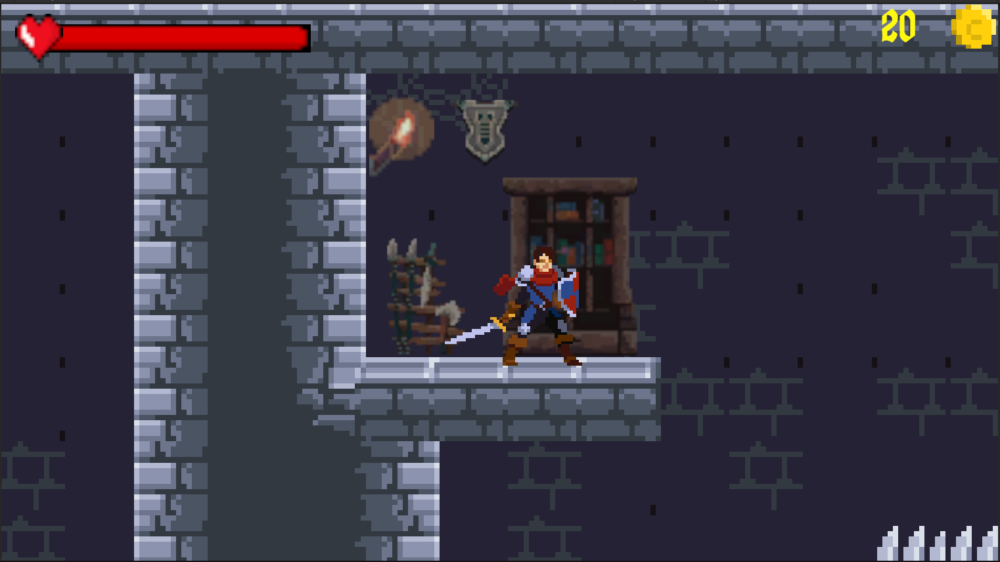
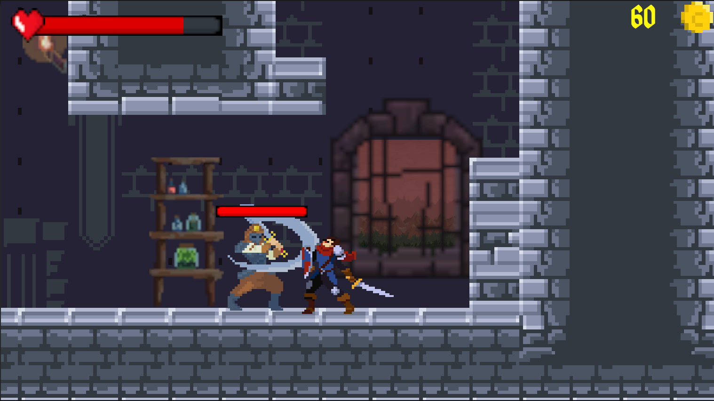
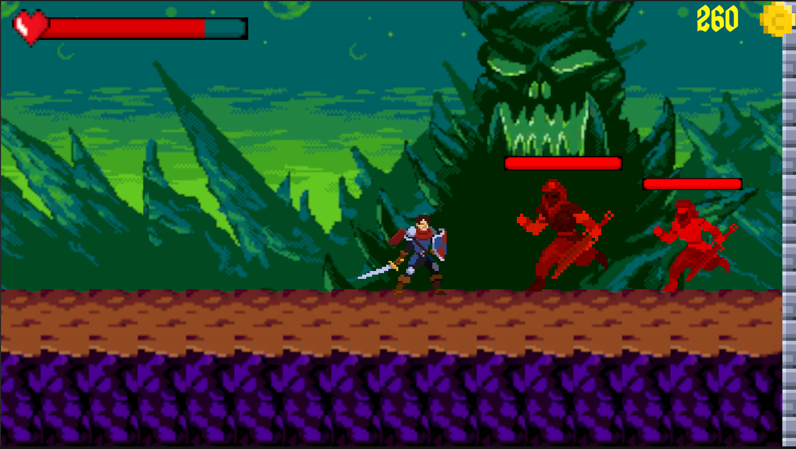

# LastHero

Game project that was made in GameDevTV 2D Course. The followings are things that I used in this project:

* Singleton Pattern
* Cinemachine Package
  * State-Driven Camera
* Animator
* Editor Scripting
* Tilemap & Tile Palette & Rule Tile
* New input system

## Theme

The devil came with his armies and killed all the heroes who opposed him, except you! The fate of humanity is in the hands of the last hero.

## Play

For Windows, check [releases](https://github.com/mustafaHTP/LastHero/releases)

## Controls

Move player → (Up, Left, Right, Down Arrows), Xbox Controller Left Stick

Jump → Xbox Controller - A

Attack → Xbox Controller - B

## Screenshots

---

---

---

---

